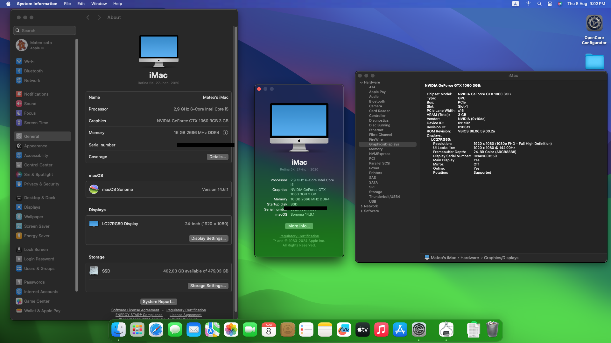

# Hackintosh EFI for i5 10400F & NVIDIA GTX 1060

*Read this in other languages: [English](#english) | [Español](#espa%C3%B1ol)*

---

## English

This repository contains the EFI folder for building a Hackintosh using the following hardware setup:

- **Processor**: Intel Core i5 10400F
- **Graphics Card**: NVIDIA GTX 1060 3GB
- **RAM**: 16GB DDR4 2666MHz
- **Motherboard**: Asus Prime B460M-A
- **Storage**: 480GB Kingston SSD

### macOS Compatibility

This setup has been tested and is compatible with the following macOS versions:

- **macOS Big Sur** (11.x)
- **macOS Monterey** (12.x)
- **macOS Ventura** (13.x)
- **macOS Sonoma** (14.x)

**Note**: The NVIDIA GTX 1060 requires OpenCore Legacy Patcher for proper driver support in macOS.

### Kexts Used

The following kexts have been included in the `config.plist` to ensure smooth operation of the Hackintosh:

1. **Lilu.kext**
2. **WhateverGreen.kext**
3. **VirtualSMC.kext**
4. **AppleALC.kext**
5. **IntelMausi.kext**
6. **USBInjectAll.kext**
7. **SMCProcessor.kext**
8. **SMCSuperIO.kext**

### Configuration & Setup

#### Bootloader

- **OpenCore Version**: [1.0.1]

#### Patcher

- **OpenCore Legacy Patcher**: Used specifically to enable NVIDIA GTX 1060 drivers in macOS.

#### Detailed Configuration

The detailed configuration can be found in the `config.plist` file included in this repository. Ensure that you adjust the SMBIOS information to match your specific system.

### Installation Guide

1. Download the EFI folder from this repository.
2. Copy the EFI folder to your USB drive (ensure it's formatted as FAT32).
3. Boot from the USB drive and follow the macOS installation process.
4. After installation, mount your system's EFI partition and copy the EFI folder to it.

### Issues and Troubleshooting

If you encounter any issues, feel free to open an issue in this repository. Provide as much detail as possible, including your hardware configuration and the macOS version you're using.

### Images

### Contributions

Contributions are welcome! If you have improvements or additional configurations, please submit a pull request.

---

## Español

Este repositorio contiene la carpeta EFI para construir un Hackintosh utilizando la siguiente configuración de hardware:

- **Procesador**: Intel Core i5 10400F
- **Tarjeta Gráfica**: NVIDIA GTX 1060 3GB
- **RAM**: 16GB DDR4 2666MHz
- **Placa Base**: Asus Prime B460M-A
- **Almacenamiento**: SSD Kingston de 480GB

### Compatibilidad con macOS

Esta configuración ha sido probada y es compatible con las siguientes versiones de macOS:

- **macOS Big Sur** (11.x)
- **macOS Monterey** (12.x)
- **macOS Ventura** (13.x)
- **macOS Sonoma** (14.x)

**Nota**: La NVIDIA GTX 1060 requiere OpenCore Legacy Patcher para un soporte adecuado de drivers en macOS.

### Kexts Utilizados

Los siguientes kexts se han incluido en el archivo `config.plist` para garantizar un funcionamiento fluido del Hackintosh:

1. **Lilu.kext**
2. **WhateverGreen.kext**
3. **VirtualSMC.kext**
4. **AppleALC.kext**
5. **IntelMausi.kext**
6. **USBInjectAll.kext**
7. **SMCProcessor.kext**
8. **SMCSuperIO.kext**

### Configuración y Setup

#### Bootloader

- **Versión de OpenCore**: [1.0.1]

#### Patcher

- **OpenCore Legacy Patcher**: Utilizado específicamente para habilitar los drivers de NVIDIA GTX 1060 en macOS.

#### Configuración Detallada

La configuración detallada se encuentra en el archivo `config.plist` incluido en este repositorio. Asegúrate de ajustar la información de SMBIOS para que coincida con tu sistema específico.

### Guía de Instalación

1. Descarga la carpeta EFI de este repositorio.
2. Copia la carpeta EFI en tu unidad USB (asegúrate de que esté formateada como FAT32).
3. Arranca desde la unidad USB y sigue el proceso de instalación de macOS.
4. Después de la instalación, monta la partición EFI de tu sistema y copia la carpeta EFI en ella.

### Problemas y Solución de Errores

Si encuentras algún problema, no dudes en abrir un issue en este repositorio. Proporciona tantos detalles como sea posible, incluyendo la configuración de tu hardware y la versión de macOS que estás utilizando.

### Imágenes

### Contribuciones

¡Las contribuciones son bienvenidas! Si tienes mejoras o configuraciones adicionales, por favor envía un pull request.

